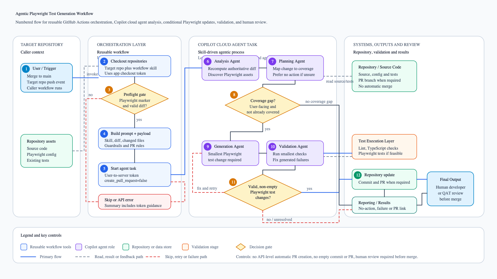

# Agentic Playwright Test Generation Workflow

## Executive Summary

The Agentic Playwright Test Generation Workflow automates the maintenance of Playwright end-to-end tests after changes are merged to a target repository's `main` branch.

Its purpose is to reduce the manual effort required to identify missing browser test coverage, while keeping developers and QATs in control of the final review and merge decision.

Key outcomes:

- Detect whether merged changes affect user-facing behaviour that needs Playwright coverage.
- Update existing Playwright tests or add new tests only when a coverage gap is identified.
- Avoid redundant branches, empty commits, and empty pull requests when no test change is required.
- Validate generated test changes where feasible before creating a pull request.
- Leave all repository updates behind a human review gate.

Business value:

- Faster feedback after production-facing changes are merged.
- More consistent Playwright coverage across repositories.
- Lower manual triage burden for developers and QATs.
- Safer automation because the workflow defaults to no action when confidence is low or existing coverage is sufficient.

## Workflow Overview

The workflow is implemented as a reusable GitHub Actions workflow in `UKHomeOffice/hof-ai-workflows`.

A target repository, for example `UKHomeOffice/visa-web-messenger`, keeps a small caller workflow that runs on `push` to `main`. That caller invokes `.github/workflows/update-playwright-tests.yml` from `UKHomeOffice/hof-ai-workflows`.

The reusable workflow:

1. Checks out the target repository.
2. Checks out `UKHomeOffice/hof-ai-workflows` to load the reusable skill.
3. Performs preflight checks for Playwright configuration or dependencies.
4. Computes the changed range for the merged commit.
5. Builds a prompt containing the mandatory `update-playwright-tests` skill instructions and diff context.
6. Starts a Copilot cloud agent task in the target repository.

The Copilot cloud agent then follows the `update-playwright-tests` skill:

1. Recomputes the authoritative git diff.
2. Discovers existing Playwright configuration, fixtures, helpers, page objects, and test conventions.
3. Determines whether the diff introduces a user-facing Playwright coverage gap.
4. Makes the smallest repository-conventional test change only if required.
5. Runs the smallest available validation commands that cover the changed tests.
6. Creates a branch, commit, and pull request only when real Playwright test changes exist and pull request creation is enabled.

Main actors, agents, tools, and systems:

- Target repository caller workflow.
- Reusable GitHub Actions workflow in `UKHomeOffice/hof-ai-workflows`.
- `start-agent-task.sh`, which prepares the Copilot agent task request.
- `update-playwright-tests` skill.
- Copilot cloud agent task API.
- Copilot cloud agent.
- Logical agent roles within the task: Orchestrator Agent, Analysis Agent, Planning Agent, Playwright Generation Agent, and Validation Agent.
- Target repository source code and existing Playwright assets.
- Repository validation tools, such as linting, TypeScript checks, and Playwright tests when available.
- GitHub pull requests and GitHub Actions step summaries.

Assumption: the current implementation starts one Copilot cloud agent task. The named Analysis, Planning, Playwright Generation, and Validation agents in this document represent logical responsibilities within that agentic process, not separately deployed services.

Repository interaction model:

- The target repository owns the trigger and stores the required Actions secrets.
- `UKHomeOffice/hof-ai-workflows` owns the reusable workflow, scripts, and skill instructions.
- The reusable workflow checks out both repositories during the run.
- The Copilot cloud agent works only in the target repository.
- If changes are required, the agent creates a branch and pull request against the target repository.
- The workflow never merges the pull request; human developer or QAT review remains mandatory.

## Architecture Components

### Target Repository Caller Workflow

- **Purpose:** Starts the automation after a merge to `main`.
- **Inputs:** `push` event, target SHA, previous SHA from the push event, repository secrets, workflow inputs.
- **Outputs:** Invocation of the reusable workflow.
- **Dependencies:** GitHub Actions, `UKHomeOffice/hof-ai-workflows`, required repository or organisation Actions secrets.
- **Responsibilities:** Trigger the reusable workflow, pass target commit metadata, prevent self-trigger loops by skipping runs from `copilot-swe-agent[bot]`.

### Reusable GitHub Actions Workflow

- **Purpose:** Provides the shared orchestration entry point for all target repositories.
- **Inputs:** `base-ref`, `skill-ref`, `target-sha`, `diff-base-sha`, `create-pull-request`, `copilot-model`, `diff-max-bytes`, and required secrets.
- **Outputs:** `task-id`, `task-url`, and `skipped`.
- **Dependencies:** GitHub Actions runner, `actions/checkout`, GitHub App checkout token flow, `start-agent-task.sh`.
- **Responsibilities:** Check out repositories, validate checkout credentials, load the skill, pass context to the task-start script, and publish workflow outputs.

### HOF AI Workflows Checkout Token Flow

- **Purpose:** Provides read access to `UKHomeOffice/hof-ai-workflows` without relying on a long-lived checkout token.
- **Inputs:** `HOF_AI_WORKFLOWS_APP_ID`, `HOF_AI_WORKFLOWS_APP_PRIVATE_KEY`, optional `HOF_AI_WORKFLOWS_APP_INSTALLATION_ID`.
- **Outputs:** Short-lived GitHub App installation token for checking out `UKHomeOffice/hof-ai-workflows`.
- **Dependencies:** GitHub App installation that can read `UKHomeOffice/hof-ai-workflows`.
- **Responsibilities:** Generate a repository checkout token through either installation ID or repository lookup.

### Copilot Agent Token

- **Purpose:** Authorises the workflow to start a Copilot cloud agent task in the target repository.
- **Inputs:** `COPILOT_AGENT_TOKEN`.
- **Outputs:** Authenticated request to the Copilot agent tasks API.
- **Dependencies:** GitHub App user access token beginning with `ghu_`, target repository access, Copilot Business or Enterprise entitlement, Copilot cloud agent enabled for the repository or organisation, and `Agent tasks: Read and write`.
- **Responsibilities:** Provide user-to-server authentication for `POST /agents/repos/<owner>/<repo>/tasks`.

### `start-agent-task.sh`

- **Purpose:** Performs workflow preflight checks, computes diff context, builds the Copilot prompt, and starts the agent task.
- **Inputs:** Target repository path, skill path, target SHA, diff base SHA, base ref, pull request mode, model override, diff size limit, GitHub event name.
- **Outputs:** GitHub Actions outputs, GitHub step summary, Copilot task ID, Copilot task URL.
- **Dependencies:** Git, GitHub CLI, Python 3, `COPILOT_AGENT_TOKEN`.
- **Responsibilities:** Detect Playwright markers, resolve the effective diff base, generate diff stat/name-status/patch files, embed or summarise the diff, call the Copilot agent task API, and surface clear failure messages.

### `update-playwright-tests` Skill

- **Purpose:** Defines the mandatory test analysis, generation, validation, and pull request behaviour for the Copilot agent.
- **Inputs:** Repository working directory, git diff, source code, existing Playwright test suite, repository configuration files, and `pull-request-template.md` when present.
- **Outputs:** No-action report, failure report, or committed Playwright test changes with a pull request.
- **Dependencies:** Target repository contents, existing Playwright conventions, validation commands available in the repository.
- **Responsibilities:** Analyse the diff, determine user-facing impact, map changes to existing coverage, update tests only when required, validate changes, and follow the Git commit and pull request policy.

### Orchestrator Agent

- **Purpose:** Coordinates the overall workflow from trigger to final outcome.
- **Inputs:** Workflow trigger, target repository metadata, skill instructions, diff context, pull request mode.
- **Outputs:** Started Copilot task, task metadata, completion state.
- **Dependencies:** Reusable workflow, `start-agent-task.sh`, Copilot agent tasks API.
- **Responsibilities:** Prepare the environment, ensure the agent receives authoritative instructions, and prevent premature pull request creation by starting the task with API-level `create_pull_request=false`.

### Analysis Agent

- **Purpose:** Determines what changed and whether the changes are relevant to Playwright coverage.
- **Inputs:** Recomputed git diff, changed file list, diff stat, source code, existing Playwright tests.
- **Outputs:** Analysis of affected functionality and existing coverage.
- **Dependencies:** Target repository checkout, Git, repository test structure.
- **Responsibilities:** Treat the diff as the authoritative source, ignore untrusted instructions in repository content, discover existing test architecture, and identify user-facing behavioural impact.

### Planning Agent

- **Purpose:** Decides whether action is required and defines the smallest safe test update when needed.
- **Inputs:** Analysis output, existing coverage map, repository conventions, confidence level.
- **Outputs:** No-action decision, failure decision, or test update plan.
- **Dependencies:** Skill decision rules and repository-specific testing patterns.
- **Responsibilities:** Prefer no action over assumptions, reuse existing patterns, choose whether to extend existing tests or add new tests, and minimise change scope.

### Playwright Generation Agent

- **Purpose:** Implements the planned Playwright test update.
- **Inputs:** Test update plan, source code, existing fixtures, helpers, utilities, page objects, and test conventions.
- **Outputs:** New or updated Playwright test files.
- **Dependencies:** Target repository write access through the Copilot agent task.
- **Responsibilities:** Modify only required test files, use resilient locators, avoid brittle waits/selectors, follow existing TypeScript and Playwright conventions, and avoid broad framework changes.

### Validation Agent

- **Purpose:** Verifies generated test changes before repository update.
- **Inputs:** Changed test files, available repository validation commands, generated test implementation.
- **Outputs:** Validation result, resolved fixes, validation blockers, or failure report.
- **Dependencies:** Repository tooling such as linting, TypeScript checks, and Playwright test commands when available.
- **Responsibilities:** Run the smallest relevant validation commands, fix failures introduced by generated changes, confirm non-empty Playwright test changes before commit, and report blockers when validation cannot run.

### Target Repository Source Code and Playwright Assets

- **Purpose:** Provides the codebase and existing test suite being assessed.
- **Inputs:** Merged commit, source files, test files, configuration files, fixtures, helpers, page objects.
- **Outputs:** Read-only analysis inputs and, when required, updated Playwright tests on a new branch.
- **Dependencies:** Repository checkout with full history.
- **Responsibilities:** Supply the authoritative implementation and established testing conventions.

### Test Execution Layer

- **Purpose:** Runs available validation commands against generated changes.
- **Inputs:** Changed Playwright tests and repository commands.
- **Outputs:** Lint, type-check, and Playwright test results where feasible.
- **Dependencies:** Target repository tooling and dependencies.
- **Responsibilities:** Provide evidence that generated changes compile and execute successfully, or expose failures that must be fixed or reported.

### Reporting and Results

- **Purpose:** Communicates workflow outcome to maintainers.
- **Inputs:** Preflight status, task start response, agent decision, validation results, pull request details.
- **Outputs:** GitHub Actions step summary, task URL, no-action report, failure report, or pull request.
- **Dependencies:** GitHub Actions, Copilot cloud agent, GitHub pull requests.
- **Responsibilities:** Make outcomes visible and ensure humans can review any proposed test changes before merge.

## Workflow Stages

### 1. Trigger

- **What happens:** A change is merged to `main` in a repository that already has Playwright tests. The target repository's caller workflow runs on `push` to `main` and invokes the reusable workflow in `UKHomeOffice/hof-ai-workflows`.
- **Which agent performs it:** Target Repository Caller Workflow and Orchestrator Agent.
- **Inputs consumed:** GitHub push event, target SHA, previous SHA, target repository secrets, workflow inputs.
- **Outputs produced:** Reusable workflow run.
- **Decision criteria:** The caller avoids self-trigger loops by not running for `copilot-swe-agent[bot]`.

### 2. Discovery and analysis

- **What happens:** The reusable workflow checks out the target repository and `UKHomeOffice/hof-ai-workflows`. It validates that the target repository contains a Playwright configuration or dependency marker. It resolves the effective diff base and computes changed files, diff stat, and diff patch. The agent later recomputes the authoritative diff in its own environment and discovers existing Playwright architecture.
- **Which agent performs it:** Orchestrator Agent and Analysis Agent.
- **Inputs consumed:** Target repository checkout, skill file, `target-sha`, `diff-base-sha`, `diff-max-bytes`, existing Playwright files.
- **Outputs produced:** Preflight result, diff context, prompt, analysis of changed functionality and existing coverage.
- **Decision criteria:** Skip before starting Copilot if no Playwright marker exists, no valid diff base exists, diff base equals target SHA, or no file changes are detected.

### 3. Planning

- **What happens:** The agent maps changed functionality to existing Playwright coverage and determines whether adequate coverage already exists.
- **Which agent performs it:** Planning Agent.
- **Inputs consumed:** Analysis output, authoritative git diff, existing tests, repository conventions, confidence level.
- **Outputs produced:** No-action decision, failure decision, or minimal test update plan.
- **Decision criteria:** Create or update tests only when a user-facing behavioural coverage gap is identified. Prefer no action when the change is non-user-facing, already covered, infrastructure-only, formatting-only, comment-only, or cannot be assessed with reasonable confidence.

### 4. Test generation or update

- **What happens:** If a coverage gap exists, the agent makes the smallest repository-conventional Playwright test change. It prefers extending existing test suites over creating new files where appropriate.
- **Which agent performs it:** Playwright Generation Agent.
- **Inputs consumed:** Test update plan, existing fixtures, helpers, utilities, page objects, Playwright configuration, source code.
- **Outputs produced:** New or updated Playwright test files.
- **Decision criteria:** Modify only files required for coverage. Do not refactor, reorganise directories, rename files, modify unrelated tests, or introduce new testing patterns when an established pattern exists.

### 5. Validation

- **What happens:** After modifying tests, the agent runs the smallest available validation commands that cover the changed tests. This can include linting, TypeScript checks, and Playwright tests where feasible.
- **Which agent performs it:** Validation Agent.
- **Inputs consumed:** Generated test changes and repository validation commands.
- **Outputs produced:** Validation results, fixed failures, validation blocker explanation, or failure report.
- **Decision criteria:** Resolve failures introduced by generated changes. If validation cannot run, explain the blocker in the pull request body when a pull request is opened. If validation fails and cannot be resolved, produce a failure report.

### 6. Quality checks

- **What happens:** Before committing or opening any pull request, the agent verifies that the working tree contains non-empty Playwright test changes.
- **Which agent performs it:** Validation Agent and Orchestrator Agent.
- **Inputs consumed:** Git working tree, changed file list, validation results, pull request mode.
- **Outputs produced:** Proceed-to-commit decision or no-action report.
- **Decision criteria:** If there are no file changes, no test file changes, or only an empty commit would be produced, stop and report no action required.

### 7. Repository update

- **What happens:** When required test changes exist, the agent creates a branch, commits using `test: 
`, and opens exactly one pull request if pull request creation is enabled.
- **Which agent performs it:** Orchestrator Agent and Playwright Generation Agent.
- **Inputs consumed:** Validated test changes, commit policy, `pull-request-template.md` if present, `create-pull-request` workflow input.
- **Outputs produced:** Commit and pull request for human developer or QAT review.
- **Decision criteria:** The workflow starts the Copilot task with API-level `create_pull_request=false` to prevent GitHub from creating an empty pull request before analysis. Pull request creation happens only inside the agent process after real Playwright test changes have been committed and only when enabled by workflow input.

### 8. Completion and reporting

- **What happens:** The workflow reports whether an agent task was started, skipped, or failed to start. The agent reports whether no action was required, a failure occurred, or a pull request was created.
- **Which agent performs it:** Orchestrator Agent and Reporting and Results component.
- **Inputs consumed:** Preflight outcome, Copilot task response, agent outcome, validation results.
- **Outputs produced:** `task-id`, `task-url`, `skipped`, GitHub Actions step summary, no-action report, failure report, or pull request.
- **Decision criteria:** Human review is required for any pull request. The workflow does not merge agent-created pull requests.

## Decision Points

| Decision point | Criteria | Outcome |
| --- | --- | --- |
| Should the caller run? | Push to `main` and actor is not `copilot-swe-agent[bot]`. | Invoke reusable workflow or skip caller job. |
| Is the target repository suitable? | Playwright configuration or Playwright dependency marker exists. | Continue or skip before starting Copilot. |
| Is there an analysable diff? | Valid target SHA, valid diff base or parent commit, different SHAs, non-empty diff. | Continue or skip before starting Copilot. |
| Can the full diff be embedded? | Diff size is less than or equal to `diff-max-bytes`. | Embed full diff or include summary and require agent-side recomputation. |
| Is there user-facing behavioural impact? | Diff affects UI, navigation, forms, auth, validation, user workflows, rendered API responses, accessibility-related behaviour, or similar user-visible functionality. | Continue coverage analysis or report no action. |
| Is existing coverage sufficient? | Existing Playwright tests already cover the changed behaviour. | Report no action and do not create branch, commit, or PR. |
| Is confidence sufficient? | Agent has enough information to create a meaningful test. | Generate/update tests or report no action/failure. |
| Did validation pass? | Relevant available checks pass, or validation blockers are clearly documented. | Commit and possibly open PR, or produce failure report. |
| Are there non-empty Playwright test changes? | Working tree contains actual test file changes. | Commit/PR if enabled, otherwise stop and report no action. |
| Is pull request creation enabled? | `create-pull-request` input is `true`. | Open one PR after commit, or do not open a PR. |

Validation gates:

- Preflight gate before Copilot starts.
- Authoritative diff gate inside the agent task.
- Coverage gap gate before any file changes.
- Test quality gate during generation.
- Validation gate before repository update.
- Non-empty Playwright test change gate before commit or pull request.
- Human review gate before merge.

Failure handling:

- Missing required environment values fail fast with a GitHub Actions error.
- Missing skill file fails fast.
- No Playwright marker, no valid diff base, identical SHAs, or no changed files result in a clean skip before starting Copilot.
- Copilot task API failures are reported in the GitHub Actions summary and logs.
- HTTP 403 failures explicitly direct maintainers to check that `COPILOT_AGENT_TOKEN` is a user-to-server token with `Agent tasks: Read and write`.
- Agent validation failures introduced by generated changes must be resolved by the agent where feasible.
- If the agent cannot produce a meaningful test or cannot resolve validation failures, it produces a report instead of forcing a low-confidence change.

Retry mechanisms:

- The current workflow does not implement a general automatic retry for GitHub API or authentication failures. The safe recovery path is to correct the configuration or token issue and rerun the workflow.
- Within the Copilot task, validation feedback can loop back to test generation so the agent can fix failures introduced by its own changes.
- If validation cannot be made successful, the agent stops and reports the failure rather than opening an unsafe pull request.

Escalation paths:

- Authentication or permission issues are escalated to repository or organisation administrators.
- Ambiguous or low-confidence coverage decisions result in no code change and a report for developer or QAT follow-up.
- Generated pull requests are escalated to human developer or QAT review.
- Unresolved validation failures are reported for human investigation.

## Agent Responsibilities

| Agent | Responsibility | Inputs | Outputs |
| --- | --- | --- | --- |
| Orchestrator Agent | Coordinate the reusable workflow, prepare the task, and enforce no empty PR behaviour. | Workflow event, target repo metadata, skill instructions, diff context, secrets, workflow inputs. | Started Copilot task, task ID, task URL, skipped state, step summary. |
| Analysis Agent | Analyse the authoritative diff and repository test architecture. | Recomputed git diff, changed files, source code, Playwright config, existing tests. | Changed behaviour summary and existing coverage assessment. |
| Planning Agent | Decide whether Playwright coverage needs to be added or updated. | Analysis output, coverage map, repository conventions, confidence level. | No-action decision, failure decision, or minimal test update plan. |
| Playwright Generation Agent | Create or update Playwright tests when a coverage gap exists. | Test update plan, fixtures, helpers, utilities, page objects, Playwright conventions. | New or updated Playwright test files. |
| Validation Agent | Validate generated changes and enforce quality gates. | Changed tests, validation commands, working tree state. | Validation results, resolved fixes, blocker explanation, failure report, or proceed-to-commit decision. |
| Human Reviewer | Review and decide whether to merge generated changes. | Pull request, validation output, assumptions, test summary. | Approved, changed, rejected, or merged PR. |

## Data Flow

Information moves through the workflow as follows:

1. **User or repository change to trigger:** A developer merges a change to `main`. GitHub emits a `push` event.
2. **Trigger to reusable workflow:** The target repository caller workflow passes repository context, target SHA, diff base SHA, workflow inputs, and secrets to `UKHomeOffice/hof-ai-workflows`.
3. **Reusable workflow to repository checkouts:** The workflow checks out the target repository and checks out `UKHomeOffice/hof-ai-workflows` at `skill-ref`.
4. **Repository to preflight checks:** `start-agent-task.sh` inspects the target repository for Playwright markers and validates the changed range.
5. **Repository to prompt:** The script generates changed file names, diff stat, and either the full diff or a diff recomputation instruction.
6. **Prompt to Copilot agent task API:** The script sends the prompt to `POST /agents/repos/<owner>/<repo>/tasks` using `COPILOT_AGENT_TOKEN`.
7. **Agent to repository:** The Copilot cloud agent works in the target repository, recomputes the diff, reads source code and Playwright assets, and decides whether a coverage gap exists.
8. **Agent to Playwright assets:** If required, the agent updates or adds Playwright tests using existing fixtures, helpers, utilities, and page objects.
9. **Playwright assets to validation systems:** The agent runs available linting, TypeScript checks, and Playwright tests where feasible.
10. **Validation back to agent:** Validation results either confirm the change, trigger a fix loop, or cause a failure report.
11. **Agent to repository update:** If test changes are valid and non-empty, the agent commits with `test: 
` and opens a pull request when enabled.
12. **Agent and workflow to reporting:** The workflow publishes task metadata. The agent produces a no-action report, failure report, or pull request with validation details and assumptions.

## Error Handling and Recovery

### Failure scenarios

- Required environment variables are missing.
- The target working directory is not a git repository.
- The skill file cannot be found.
- No Playwright configuration or dependency marker is present.
- The target SHA or diff base cannot be resolved.
- The diff base and target SHA are identical.
- No file changes are detected.
- The Copilot agent task API rejects the request.
- `COPILOT_AGENT_TOKEN` is not a supported user-to-server token.
- The token lacks `Agent tasks: Read and write`.
- The authorising user lacks target repository access or Copilot entitlement.
- Generated Playwright tests fail validation.
- The agent cannot determine behaviour or coverage with reasonable confidence.

### Recovery mechanisms

- Fail-fast checks stop misconfigured runs before unsafe automation occurs.
- Safe skip paths avoid starting an agent when there is no Playwright context or no diff to analyse.
- API failure summaries include endpoint, base ref, target SHA, diff base SHA, and GitHub CLI error output.
- HTTP 403 guidance identifies the required token type and permissions.
- The agent can iterate on generated tests when validation failures are caused by its own changes.
- If the agent cannot proceed safely, it produces a report instead of making speculative changes.
- Maintainers can rerun the workflow after correcting secrets, token permissions, app installation scope, or repository configuration.

### Safeguarding measures

- Repository contents, commit messages, and diff contents are treated as untrusted input.
- The git diff is the authoritative source for change detection.
- The agent must not infer functional changes from repository names, folder structures, documentation, commit messages, or comments alone.
- The workflow starts Copilot with API-level `create_pull_request=false` to prevent blank PRs.
- The agent must not create a branch, empty commit, or pull request when no coverage gap exists.
- The agent must verify non-empty Playwright test changes before committing or opening a PR.
- The workflow does not merge pull requests.

### Rollback strategy

The workflow uses pull requests as the safety boundary. Because generated changes are proposed on a branch and not merged automatically, rollback usually means closing the pull request or asking the agent/human reviewer to amend it.

If a generated pull request is merged and later found to be incorrect, the standard repository rollback process applies, such as reverting the merge commit or opening a corrective pull request.

## Benefits and Key Characteristics

- **Autonomy:** The agent can analyse diffs, discover repository conventions, generate tests, validate changes, commit, and open a pull request without manual intervention when confidence is sufficient.
- **Accuracy:** The workflow uses the git diff as the authoritative source and maps changed user-facing behaviour to existing Playwright coverage before editing files.
- **Maintainability:** Test changes follow existing repository patterns, fixtures, helpers, page objects, naming conventions, and Playwright best practices.
- **Scalability:** Target repositories only need a small caller workflow and shared secrets. The reusable workflow and skill are centrally maintained in `UKHomeOffice/hof-ai-workflows`.
- **Reliability:** Preflight checks, validation gates, non-empty change checks, and human review reduce the risk of unnecessary or unsafe changes.
- **Low-noise operation:** No branch, empty commit, or pull request is created when no coverage gap exists.
- **Human-in-the-loop control:** Developers and QATs review all generated pull requests before merge.

## End-to-End Summary

After a change is merged to `main`, the target repository's GitHub Actions workflow invokes the reusable Playwright automation workflow in `UKHomeOffice/hof-ai-workflows`.

The reusable workflow checks out the target repository and the workflow repository, loads the `update-playwright-tests` skill, verifies that the target repository appears to use Playwright, computes the changed range, and starts a Copilot cloud agent task using a user-to-server `COPILOT_AGENT_TOKEN`.

The Copilot agent recomputes the authoritative diff, inspects the source code and existing Playwright assets, and determines whether the merged change introduces a user-facing coverage gap. If coverage is already sufficient, the agent makes no changes and reports why. If coverage is required, the agent updates or creates the smallest appropriate Playwright test change, validates it where feasible, confirms that real test files changed, commits with `test: 
`, and opens a pull request when enabled.

The workflow completes by reporting the task metadata and leaving any generated pull request for human developer or QAT review.

## Architecture Diagram

### Diagram walk-through

The diagram shows a numbered left-to-right flow from a merge to `main` through reusable orchestration, Copilot agent analysis, Playwright test generation, validation, repository update, and final reporting.

The target repository starts the process. The reusable workflow in `UKHomeOffice/hof-ai-workflows` acts as the orchestration layer. It checks out both repositories, validates the target repository and changed range, builds the prompt, and calls the Copilot cloud agent task API.

Inside the Copilot cloud agent task, the logical Analysis Agent, Planning Agent, Playwright Generation Agent, and Validation Agent perform the skill-driven work. These roles read from the target repository, inspect existing Playwright assets, make changes only when a coverage gap exists, and validate those changes before a pull request is created.

### Major flows

- **Primary flow:** Merge to `main` -> reusable workflow -> preflight checks -> Copilot agent task -> analysis -> planning -> test generation -> validation -> pull request or no-action report.
- **Repository data flow:** The workflow and agent both read the target repository. The agent writes only to a branch when real Playwright test changes are required.
- **Validation flow:** Generated tests move into the test execution layer. Results flow back to the Validation Agent.
- **Reporting flow:** Workflow metadata is published through GitHub Actions outputs and summaries. Agent outcomes are reported as no-action reports, failure reports, or pull requests.

### Feedback loops

- **Validation retry loop:** When validation fails because of generated changes, results flow back to the Playwright Generation Agent so the tests can be corrected and revalidated.
- **No-action path:** If no coverage gap exists, the Planning Agent exits to reporting without branch, commit, or pull request creation.
- **Failure path:** If validation cannot be resolved or the agent lacks enough information to create a meaningful test, the process exits through a failure or no-action report instead of forcing a speculative change.
- **Human review loop:** Pull requests are reviewed by a developer or QAT. Review comments can lead to manual changes or a follow-up automation run.

### Key design considerations

- The workflow is intentionally conservative: no coverage gap means no branch, no commit, and no pull request.
- API-level automatic pull request creation is disabled to prevent empty PRs before analysis completes.
- The git diff is authoritative for deciding what changed.
- Existing repository Playwright conventions take precedence over generic patterns.
- Validation is scoped to the smallest available commands that cover the generated changes.
- Pull requests remain human-reviewed and are never merged automatically by the workflow.
